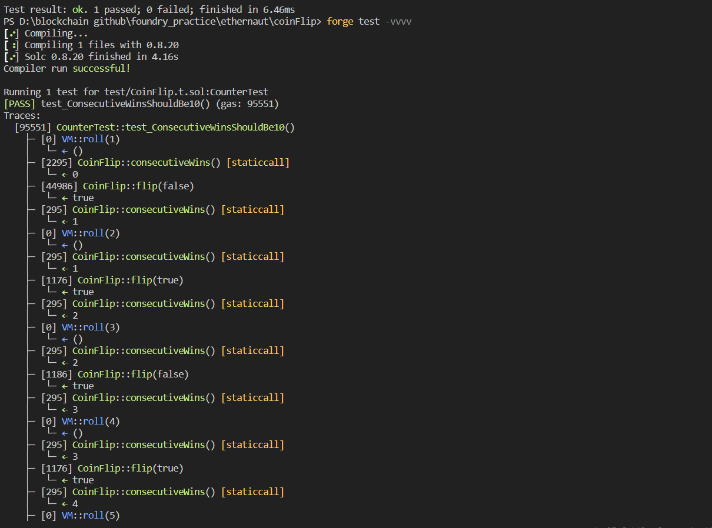
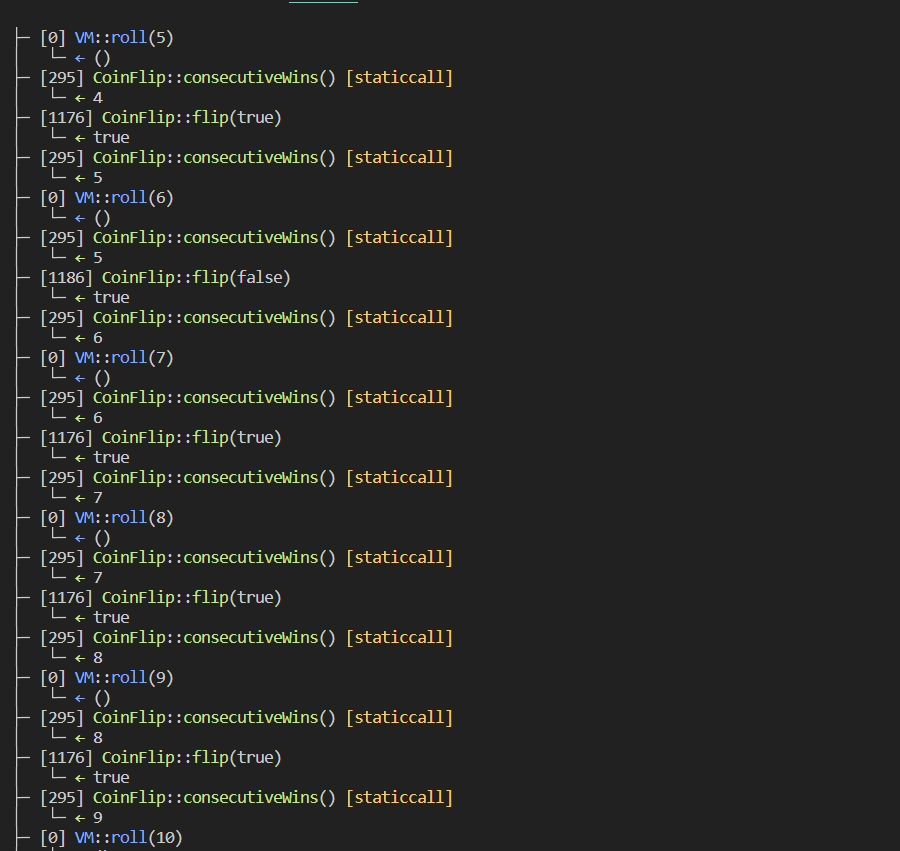
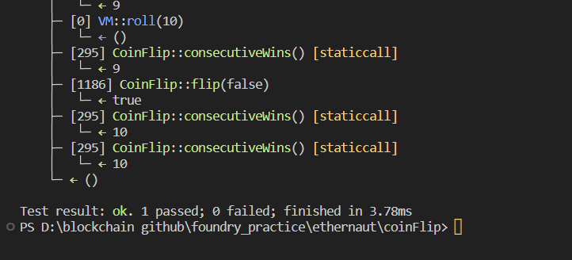

# Question Statement

This is a coin flipping game where you need to build up your winning streak by guessing the outcome of a coin flip. To complete this level you'll need to use your psychic abilities to guess the correct outcome 10 times in a row.
- Reference -> https://ethernaut.openzeppelin.com/level/0x9240670dbd6476e6a32055E52A0b0756abd26fd2


## Test Code Files

- [CionFlip.t.sol](./test/CoinFlip.t.sol)

# Test Output 






# Code Setup 
``` 
$ forge install
$ forge build
$ forge test -vvvv
```

# Reference 
- [vm.roll()](https://book.getfoundry.sh/cheatcodes/roll)
