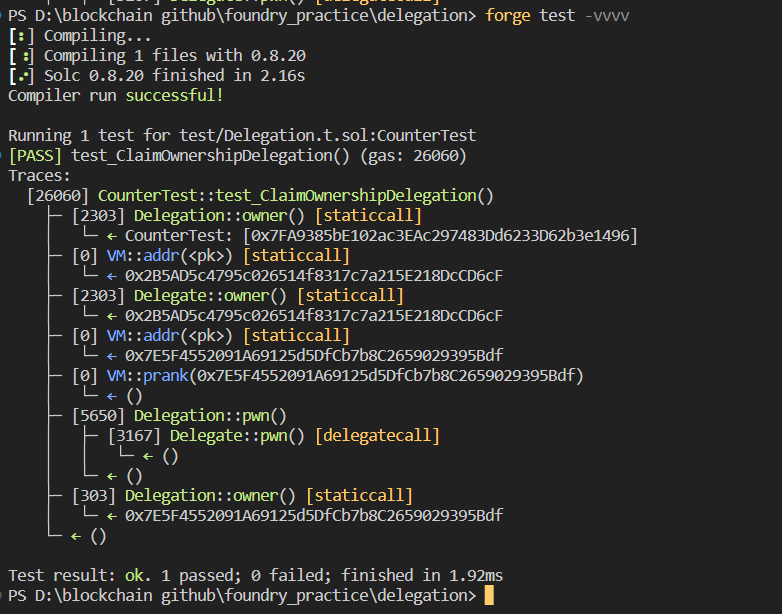

# Question Statement
The goal of this level is for you to claim ownership of the instance you are given.

  Things that might help

    Look into Solidity's documentation on the delegatecall low level function, how it works, how it can be used to delegate operations to on-chain libraries, and what implications it has on execution scope.
    Fallback methods
    Method ids

- Reference ->
https://ethernaut.openzeppelin.com/level/0xF781b45d11A37c51aabBa1197B61e6397aDf1f78

## Solution Approach
Anyone can call this function from Delegaiton.sol and can change the owner through delegate call through Delegate contract
```solidity
 fallback() external {
        (bool result, ) = address(delegate).delegatecall(msg.data);
        if (result) {
            this;
        }
    }
```

## Test Code Files

- [Delegation.t.sol](./test/Delegation.t.sol)

# Test Output 


# Code Setup 
``` 
$ forge install
$ forge build
$ forge test -vvvv
```

# Reference 
- [assertEq()](https://book.getfoundry.sh/reference/forge-std/assertEq)
- [vm.prank()](https://book.getfoundry.sh/cheatcodes/prank)
- [vm.addr()](https://book.getfoundry.sh/cheatcodes/addr)