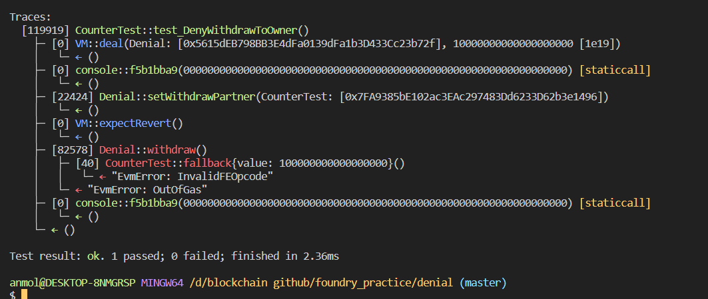

# Question Statement
This is a simple wallet that drips funds over time. You can withdraw the funds slowly by becoming a withdrawing partner.

If you can deny the owner from withdrawing funds when they call withdraw() (whilst the contract still has funds, and the transaction is of 1M gas or less) you will win this level.

- Reference ->
https://ethernaut.openzeppelin.com/level/0x2427aF06f748A6adb651aCaB0cA8FbC7EaF802e6

## Solution Approach
comsume all the gas in fallback function 
## Test Code Files

- [Denial.t.sol](./test/Denial.t.sol)

# Test Output 


# Code Setup 
``` 
$ forge install
$ forge build
$ forge test -vvvv
```