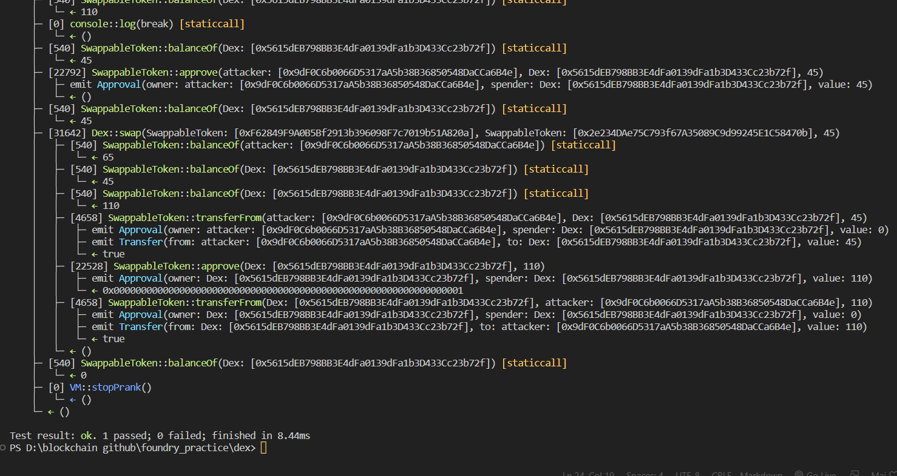

# Question Statement
The goal of this level is for you to hack the basic DEX contract below and steal the funds by price manipulation.

You will start with 10 tokens of token1 and 10 of token2. The DEX contract starts with 100 of each token.

You will be successful in this level if you manage to drain all of at least 1 of the 2 tokens from the contract, and allow the contract to report a "bad" price of the assets.

 
Quick note

Normally, when you make a swap with an ERC20 token, you have to approve the contract to spend your tokens for you. To keep with the syntax of the game, we've just added the approve method to the contract itself. So feel free to use contract.approve(contract.address, <uint amount>) instead of calling the tokens directly, and it will automatically approve spending the two tokens by the desired amount. Feel free to ignore the SwappableToken contract otherwise.

  Things that might help:

    How is the price of the token calculated?
    How does the swap method work?
    How do you approve a transaction of an ERC20?
    Theres more than one way to interact with a contract!
    Remix might help
    What does "At Address" do?

- Reference -> https://ethernaut.openzeppelin.com/level/0x9CB391dbcD447E645D6Cb55dE6ca23164130D008


## Solution Approach 
Here we have to swap the token alternatively as the following code is vulnerable because it provide more token when we swap. 
```solidity
 function getSwapPrice(
        address from,
        address to,
        uint amount
    ) public view returns (uint) {
        return ((amount * IERC20(to).balanceOf(address(this))) /
            IERC20(from).balanceOf(address(this)));
    }
```

## Test Code Files
- [Dex.t.sol](./test/Dex.t.sol)

# Test Output 


# Code Setup 
``` 
$ forge install
$ forge build
$ forge test -vvvv
```

 