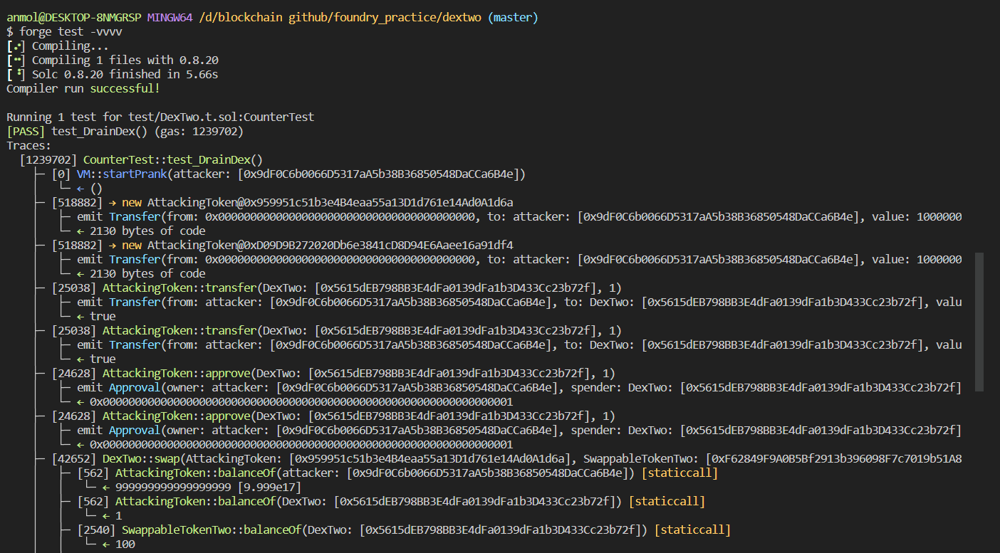

# Question Statement
This level will ask you to break DexTwo, a subtlely modified Dex contract from the previous level, in a different way.

You need to drain all balances of token1 and token2 from the DexTwo contract to succeed in this level.

You will still start with 10 tokens of token1 and 10 of token2. The DEX contract still starts with 100 of each token.

  Things that might help:

    How has the swap method been modified?

- Reference ->
https://ethernaut.openzeppelin.com/level/0x0b6F6CE4BCfB70525A31454292017F640C10c768

## Solution Approach
no require statement in swap function of dex for checking the token contract address we can use the another erc20 token to manipulate the contract 

## Test Code Files

- [DexTwo.t.sol](./test/DexTwo.t.sol)

# Test Output 


# Code Setup 
``` 
$ forge install
$ forge build
$ forge test -vvvv
```