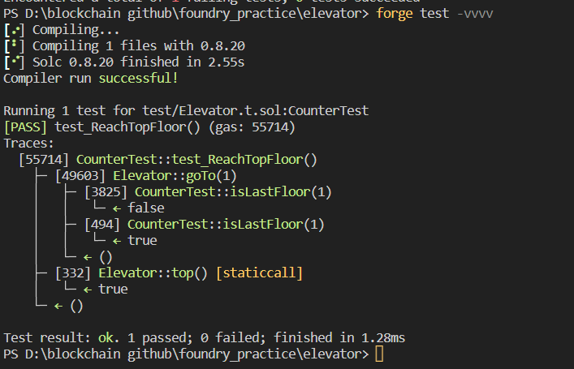

# Question Statement
This elevator won't let you reach the top of your building. Right?
Things that might help:

    Sometimes solidity is not good at keeping promises.
    This Elevator expects to be used from a Building.

- Reference ->
https://ethernaut.openzeppelin.com/level/0x4A151908Da311601D967a6fB9f8cFa5A3E88a251

 
## Test Code Files

- [Elevator.t.sol](./test/Elevator.t.sol)

# Test Output 


# Code Setup 
``` 
$ forge install
$ forge build
$ forge test -vvvv
```

# Reference 
- [assertEq()](https://book.getfoundry.sh/reference/forge-std/assertEq)
