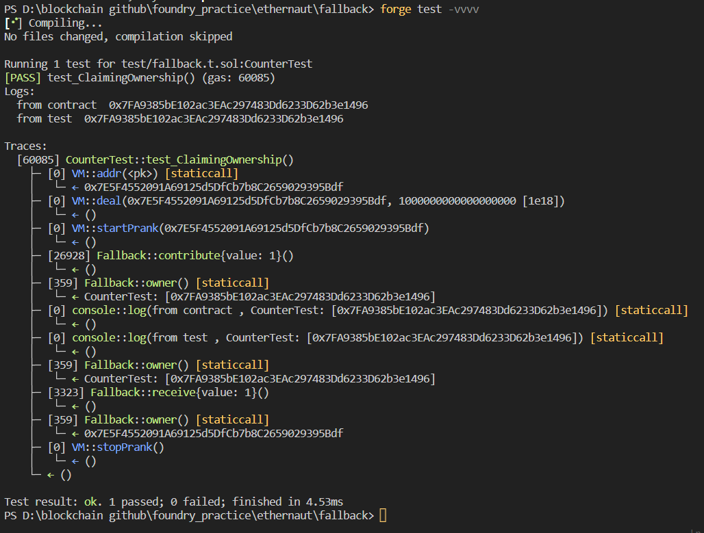

# Question Statement
Look carefully at the contract's code below.

You will beat this level if

    you claim ownership of the contract
    you reduce its balance to 0

  Things that might help

    How to send ether when interacting with an ABI
    How to send ether outside of the ABI
    Converting to and from wei/ether units (see help() command)
    Fallback methods

- Reference -> https://ethernaut.openzeppelin.com/level/0x80934BE6B8B872B364b470Ca30EaAd8AEAC4f63F

# Test Code File 
- [fallback.t.sol](./test/fallback.t.sol)


# Test Output 



# Code Setup 
``` 
$ forge install
$ forge build
$ forge test -vvvv
```

# Reference
- [vm.addr()](https://book.getfoundry.sh/cheatcodes/addr)
- [vm.startPrank()](https://book.getfoundry.sh/cheatcodes/start-prank)
- [vm.stopPrank()](https://book.getfoundry.sh/cheatcodes/stop-prank)
- [vm.deal()](https://book.getfoundry.sh/cheatcodes/deal)
- [vm.assertEq()](https://book.getfoundry.sh/reference/forge-std/assertEq)