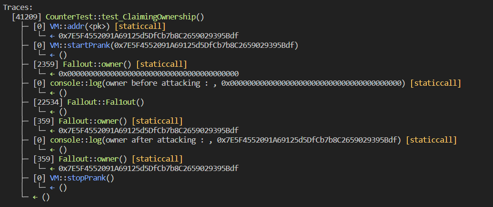
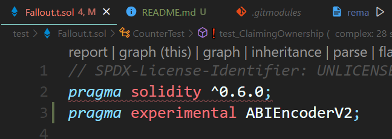

# Question Statement
Claim ownership of the contract below to complete this level.
- Reference -> https://ethernaut.openzeppelin.com/level/0x0AA237C34532ED79676BCEa22111eA2D01c3d3e7

# Test Code File 
- [Fallout.t.sol](./test/Fallout.t.sol)


# Test Output 



# Contract Setup in Foundry

### install the following openzepplin release for using SafeMath.sol
https://github.com/OpenZeppelin/openzeppelin-contracts/commits/release-v3.0.0

 
### after installing this module you are going to get the following error
https://github.com/foundry-rs/foundry/issues/4376

### solution of this error 


# Code Setup 
``` 
$ forge install
$ forge build
$ forge test -vvvv
```

# Reference
- [vm.addr()](https://book.getfoundry.sh/cheatcodes/addr)
- [vm.startPrank()](https://book.getfoundry.sh/cheatcodes/start-prank)
- [vm.stopPrank()](https://book.getfoundry.sh/cheatcodes/stop-prank)
- [vm.assertEq()](https://book.getfoundry.sh/reference/forge-std/assertEq)