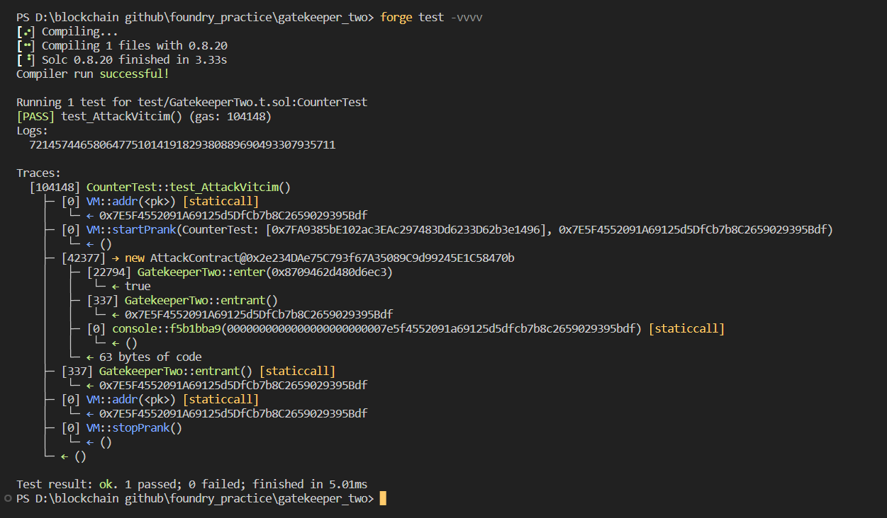

# Question Statement
This gatekeeper introduces a few new challenges. Register as an entrant to pass this level.

Things that might help:

    Remember what you've learned from getting past the first gatekeeper - the first gate is the same.
    The assembly keyword in the second gate allows a contract to access functionality that is not native to vanilla Solidity. See here for more information. The extcodesize call in this gate will get the size of a contract's code at a given address - you can learn more about how and when this is set in section 7 of the yellow paper.
    The ^ character in the third gate is a bitwise operation (XOR), and is used here to apply another common bitwise operation (see here). The Coin Flip level is also a good place to start when approaching this challenge.

- Reference ->
https://ethernaut.openzeppelin.com/level/0xf59112032D54862E199626F55cFad4F8a3b0Fce9

## Solution Approach
use the constructor of other contract to call the victim contract's function as during constructor call the size of code in any contract will be 0.

## Test Code Files

- [GatekeeperTwo.t.sol](./test/GatekeeperTwo.t.sol)

# Test Output 


# Code Setup 
``` 
$ forge install
$ forge build
$ forge test -vvvv
```

# Reference 
- [assertEq()](https://book.getfoundry.sh/reference/forge-std/assertEq)
- [vm.startPrank()](https://book.getfoundry.sh/cheatcodes/start-prank)
- [vm.stopPrank()](https://book.getfoundry.sh/cheatcodes/stop-prank)
- [vm.addr()](https://book.getfoundry.sh/cheatcodes/addr)
 