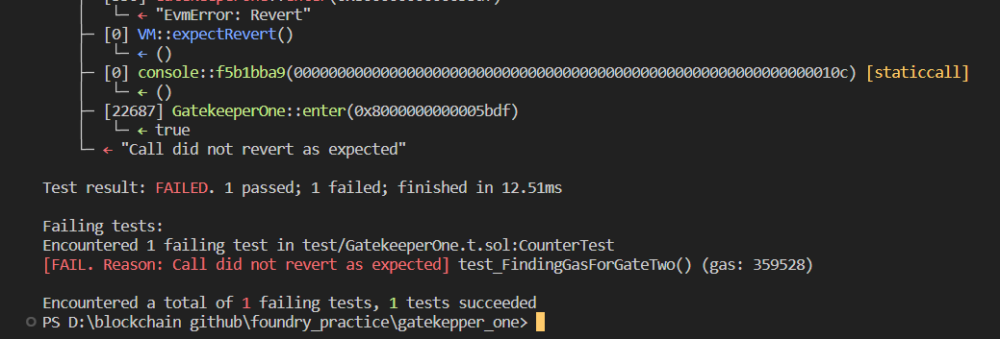
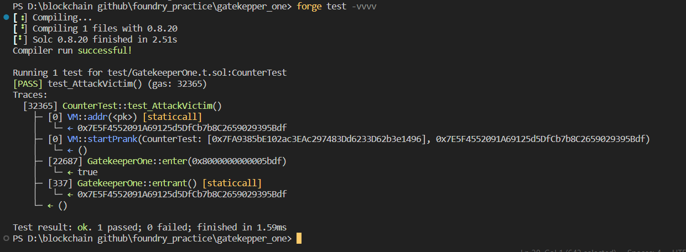

# Question Statement
Make it past the gatekeeper and register as an entrant to pass this level.
- Reference ->
https://ethernaut.openzeppelin.com/level/0x2a2497aE349bCA901Fea458370Bd7dDa594D1D69

## Solution Approach
Find the gas require to pass gateOne and then reverse the logic of gateThree to find _gateKey

## Test Output



 
# Code Setup 
``` 
$ forge install
$ forge build
$ forge test -vvvv
```

# Reference 
- [vm.assertEq()](https://book.getfoundry.sh/reference/forge-std/assertEq)
- [vm.startPrank()](https://book.getfoundry.sh/cheatcodes/start-prank)
- [vm.stopPrank()](https://book.getfoundry.sh/cheatcodes/stop-prank)
- [vm.addr()](https://book.getfoundry.sh/cheatcodes/addr)
- [vm.expectRevert()](https://book.getfoundry.sh/cheatcodes/expect-revert)
