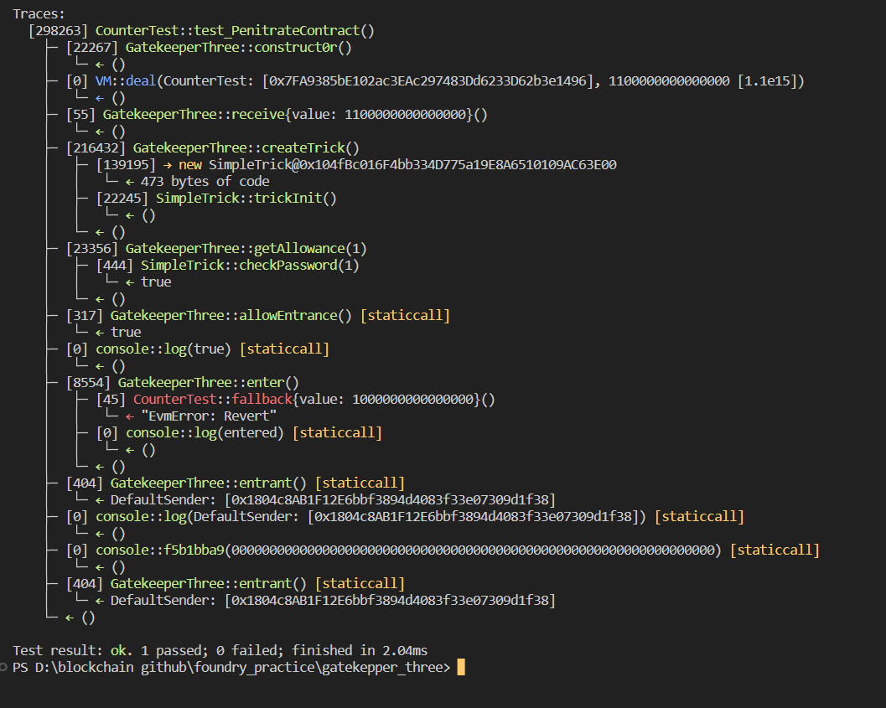

# Question Statement
Cope with gates and become an entrant.
Things that might help:

    Recall return values of low-level functions.
    Be attentive with semantic.
    Refresh how storage works in Ethereum.

- Reference ->
https://ethernaut.openzeppelin.com/level/0x03aFA729959cDB6EA3fAD8572b718E88df0594af

## Solution Approach
use same transaction for entering the contract to have the same password or if the trick contract already deployed then we can access the private state variables from cli;
## Test Code Files

- [GatekeeperThree.t.sol](./test/GatekeeperThree.t.sol)

# Test Output 


# Code Setup 
``` 
$ forge install
$ forge build
$ forge test -vvvv
```