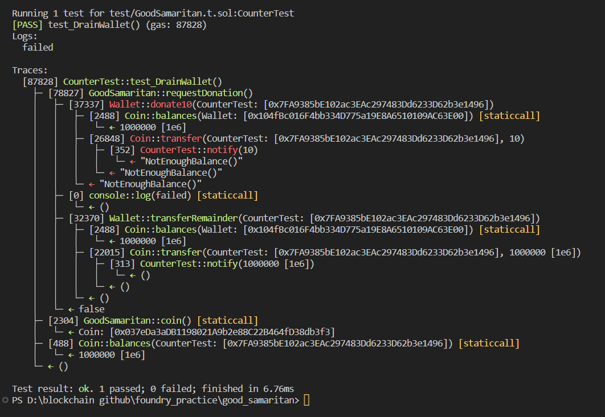

# Question Statement
This instance represents a Good Samaritan that is wealthy and ready to donate some coins to anyone requesting it.

Would you be able to drain all the balance from his Wallet?

- Reference ->
https://ethernaut.openzeppelin.com/level/0x8586Fe7809208B08691A1D225ab2648De02de76B

## Solution Approach
```solidity
 function notify(uint256 amount) external {
        if (amount == 10) revert NotEnoughBalance();
    }
```

## Test Code Files

- [GoodSamaritan.t.sol](./test/GoodSamaritan.t.sol)

# Test Output 


# Code Setup 
``` 
$ forge install
$ forge build
$ forge test -vvvv
```