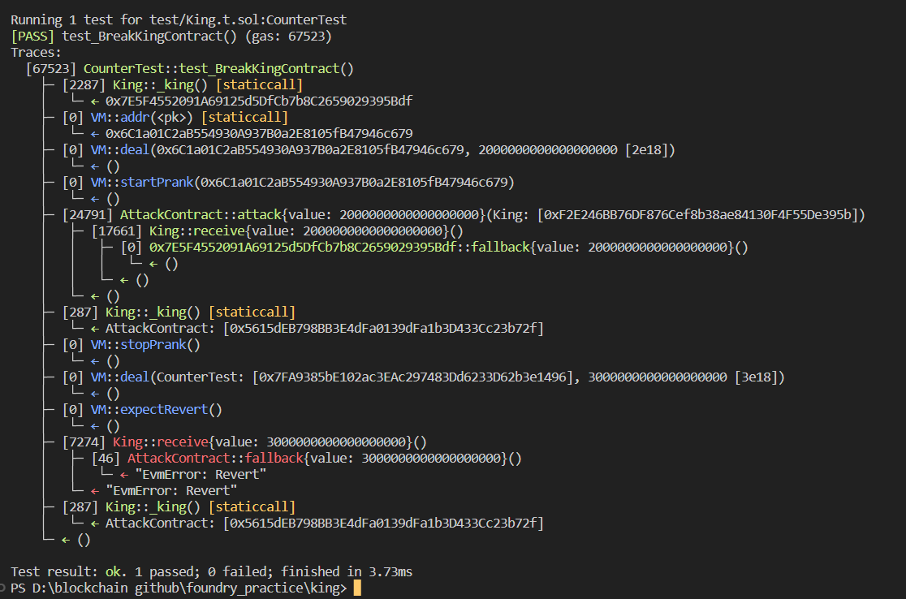

# Question Statement
The contract below represents a very simple game: whoever sends it an amount of ether that is larger than the current prize becomes the new king. On such an event, the overthrown king gets paid the new prize, making a bit of ether in the process! As ponzi as it gets xD

Such a fun game. Your goal is to break it.
- Reference ->
https://ethernaut.openzeppelin.com/level/0x725595BA16E76ED1F6cC1e1b65A88365cC494824

## Solution Approach
Denial of Service by not adding any payable fallback function in the attacking contract.

## Test Code Files

- [King.t.sol](./test/King.t.sol)

# Test Output 


# Code Setup 
``` 
$ forge install
$ forge build
$ forge test -vvvv
```

# Reference 
- [assertEq()](https://book.getfoundry.sh/reference/forge-std/assertEq)
- [vm.startPrank()](https://book.getfoundry.sh/cheatcodes/start-prank)
- [vm.stopPrank()](https://book.getfoundry.sh/cheatcodes/stop-prank)
- [vm.addr()](https://book.getfoundry.sh/cheatcodes/addr)
- [vm.deal()](https://book.getfoundry.sh/cheatcodes/deal)
- [vm.expectRevert()](https://book.getfoundry.sh/cheatcodes/expect-revert)