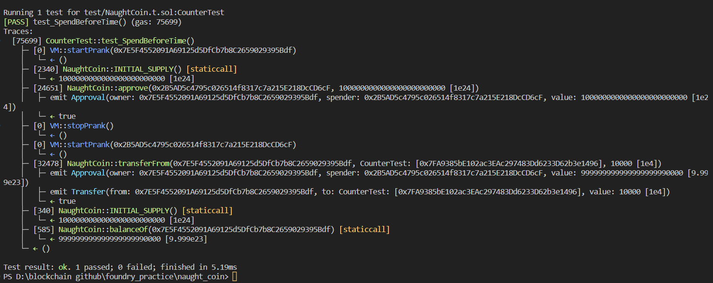

# Question Statement
NaughtCoin is an ERC20 token and you're already holding all of them. The catch is that you'll only be able to transfer them after a 10 year lockout period. Can you figure out how to get them out to another address so that you can transfer them freely? Complete this level by getting your token balance to 0.

  Things that might help

    The ERC20 Spec
    The OpenZeppelin codebase

- Reference ->
https://ethernaut.openzeppelin.com/level/0x36E92B2751F260D6a4749d7CA58247E7f8198284

## Solution Approach
provide access to other account from approve and then spend from transferFrom method of erc20.


## Code Setup
Run the following command to install openzepplin erc20 contract where it uses solidity version 0.8.0.

```
forge install OpenZeppelin/openzeppelin-contracts@v4.9.0
```

## Test Code Files

- [NaughtCoin.t.sol](./test/NaughtCoin.t.sol)

# Test Output 


# Code Setup 
``` 
$ forge install
$ forge build
$ forge test -vvvv
```

# Reference 
- [assertEq()](https://book.getfoundry.sh/reference/forge-std/assertEq)
- [vm.startPrank()](https://book.getfoundry.sh/cheatcodes/start-prank)
- [vm.stopPrank()](https://book.getfoundry.sh/cheatcodes/stop-prank)
- [vm.addr()](https://book.getfoundry.sh/cheatcodes/addr)
 