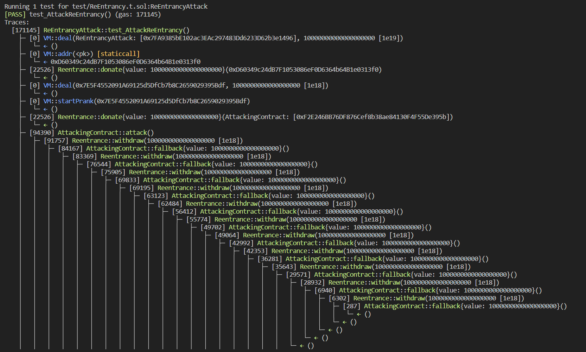
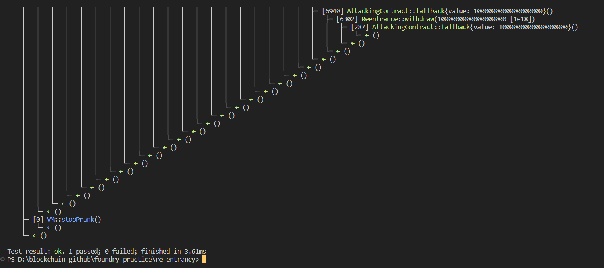

# Question Statement
The goal of this level is for you to steal all the funds from the contract.

  Things that might help:

    Untrusted contracts can execute code where you least expect it.
    Fallback methods
    Throw/revert bubbling
    Sometimes the best way to attack a contract is with another contract.
- Reference ->
https://ethernaut.openzeppelin.com/level/0x573eAaf1C1c2521e671534FAA525fAAf0894eCEb

## Solution Approach
payable fallback function withdraw funds again before the balances record updated in contract

## Test Code Files

- [ReEntrancy.t.sol](./test/ReEntrancy.t.sol)

# Test Output 



# Code Setup 
``` 
$ forge install
$ forge build
$ forge test -vvvv
```

# Reference 
- [vm.assertEq()](https://book.getfoundry.sh/reference/forge-std/assertEq)
- [vm.startPrank()](https://book.getfoundry.sh/cheatcodes/start-prank)
- [vm.stopPrank()](https://book.getfoundry.sh/cheatcodes/stop-prank)
- [vm.addr()](https://book.getfoundry.sh/cheatcodes/addr)
- [vm.deal()](https://book.getfoundry.sh/cheatcodes/deal)
