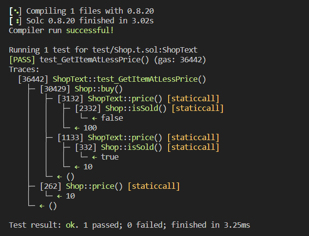

# Question Statement
Сan you get the item from the shop for less than the price asked?
Things that might help:

    Shop expects to be used from a Buyer
    Understanding restrictions of view functions

- Reference ->
https://ethernaut.openzeppelin.com/level/0xCb1c7A4Dee224bac0B47d0bE7bb334bac235F842

## Test Code Files
- [Shop.t.sol](./test/Shop.t.sol)

# Test Output 


# Code Setup 
``` 
$ forge install
$ forge build
$ forge test -vvvv
```

# Reference 
- [assertTrue()](https://book.getfoundry.sh/reference/ds-test?highlight=assertTrue#assertion-functions)
 