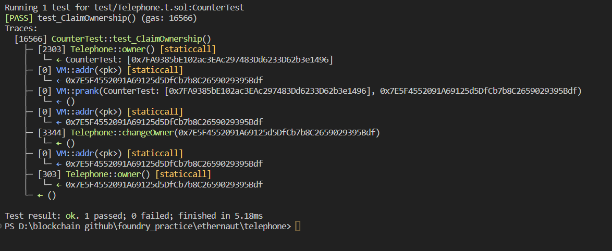

# Question Statement
Claim ownership of the contract below to complete this level.
- Reference ->
https://ethernaut.openzeppelin.com/level/0x1ca9f1c518ec5681C2B7F97c7385C0164c3A22Fe

## Test Code Files

- [Telephone.t.sol](./test/Telephone.t.sol)

# Test Output 



# Code Setup 
``` 
$ forge install
$ forge build
$ forge test -vvvv
```

# Reference 
- [vm.addr()](https://book.getfoundry.sh/cheatcodes/addr)
- [vm.prank()](https://book.getfoundry.sh/cheatcodes/prank)