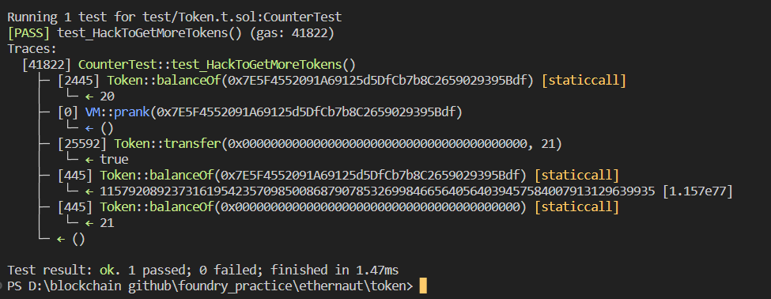

# Question Statement
The goal of this level is for you to hack the basic token contract below.

You are given 20 tokens to start with and you will beat the level if you somehow manage to get your hands on any additional tokens. Preferably a very large amount of tokens.
- Reference ->
https://ethernaut.openzeppelin.com/level/0xB4802b28895ec64406e45dB504149bfE79A38A57

## Solution Approach
Underflow vulnerability
```solidity
function transfer(address _to, uint _value) public returns (bool) {
    require(balances[msg.sender] - _value >= 0);
    balances[msg.sender] -= _value;
    balances[_to] += _value;
    return true;
  }

```

## Test Code Files

- [Token.t.sol](./test/Token.t.sol)

# Test Output 



# Code Setup 
``` 
$ forge install
$ forge build
$ forge test -vvvv
```

# Reference 
- [vm.assertEq()](https://book.getfoundry.sh/reference/forge-std/assertEq)
- [vm.prank()](https://book.getfoundry.sh/cheatcodes/prank)