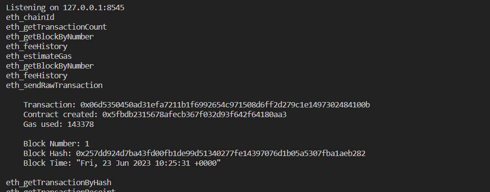
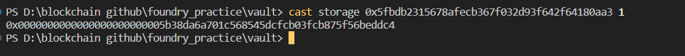
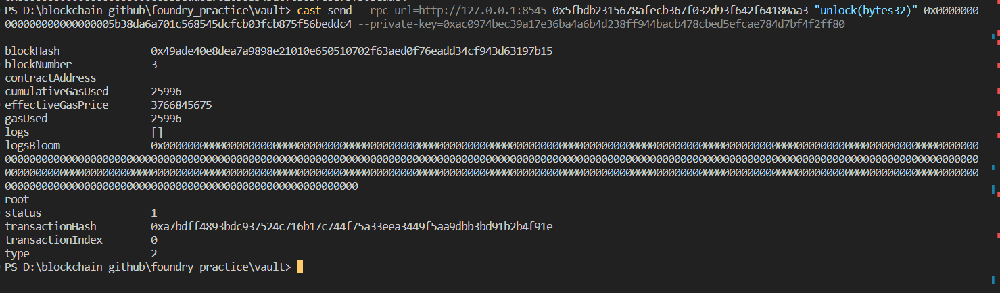
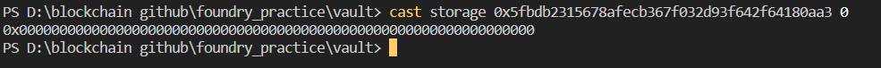

# Question Statement
Unlock the vault to pass the level!
- Reference -> https://ethernaut.openzeppelin.com/level/0x3A78EE8462BD2e31133de2B8f1f9CBD973D6eDd6

# Solution Approach
- **we cannot access the storage of contract from another smart contract for that reason I used anvil and cast**
- use anvil to deploye the code
- use cast to access private state variables data


# Output 
- Anvil Deployment

- Cast <br/>
Accessing private data

Calling vault.unlock(_password)

Checking the Result {vault.locked() should return false}



# Contract Setup in Foundry

### install the following openzepplin release for using SafeMath.sol
https://github.com/OpenZeppelin/openzeppelin-contracts/commits/release-v3.0.0

 
### after installing this module you are going to get the following error
https://github.com/foundry-rs/foundry/issues/4376

### solution of this error 


# Code Setup 
``` 
$ forge install
$ forge build
$ forge create --rpc-url http://127.0.0.1:8545 --private-key <private key from anvil> .\src\Vault.sol:Vault --constructor-args <argument>
$ cast storage <contract-address> <slot>
$ cast send --rpc-url=http://127.0.0.1:8545 <contract-address> "unlock(bytes32)" <argument value> --private-key=<private key from anvil>
```

 